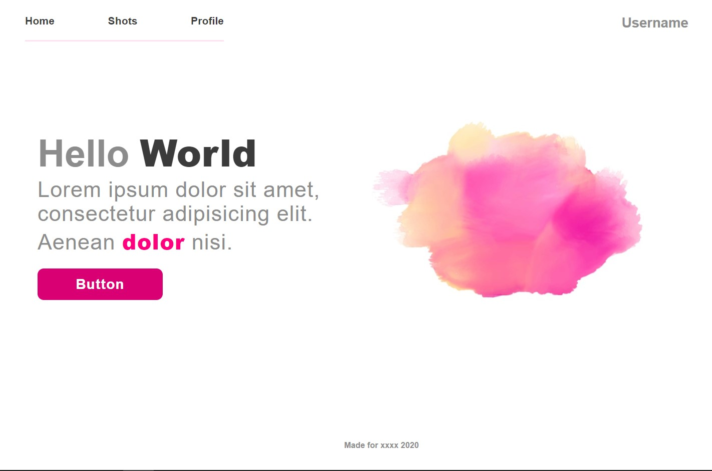

# Accessible Landing Page

This is an example of a landing page using Stylus as CSS Preprocessor. This project also implements good practices in order to satisfy the Web Accessibility needs.

## Technologies

* HTML5

* CSS3

* Stylus

## Page Preview



### Install
```
npm install
```

### Run Project
```
npm run start
```

### Compile Stylus into CSS
```
npm run stylus
```
